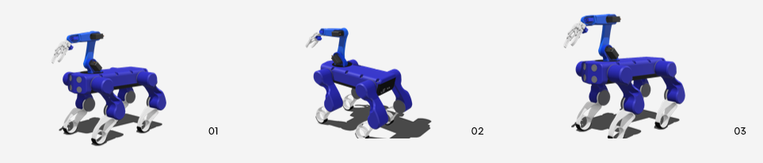

# Project A.X.L

This is a open-source Quadrupled(four legged) Robot project based of spot micro which is inspired by Boston Dynamics Spot Robot.



## Table of Contents

- [Introduction](#introduction)
- [Electronics & Hardware](#electronics--hardware)
- [Software](#software)
- [Installation](#installation)
     - [Basic Build](#basic-build)
     - [ROS Build](#ros-build)
- [Project Structure](#project-structure)
- [Credits](#credits)
- [References & External Links](#external-links-and-references)


## Introduction

This project is the source code for a quadruped, a 4 legged open source robot. This code implements motion control of a 3d printed spot micro robot, including sit, stand, angle and walk control. Supporting libraries provide additional capabilities, such as mapping through SLAM and a body mounted lidar.

This Repo contains a updated basic build and ROS build.
- The updated basic build is a simple quadrupled robot which can be controlled using a joystick and also easier for beginners.
- The updated Ros build is using `ubuntu 20.04 LTS` and `ROS Noetic`.

## Electronics & Hardware

The frame utilized is the 3D printed design from Thingverse Spot Micro frame developed by KDY0523. See [the thingverse page](https://www.thingiverse.com/thing:3445283) for additional details for assembly hardware.

Component List:
* Computer: Raspberry Pi 4B (any raspi board should be fine)
* Servo control board: PCA9685, controlled via i2c
* Servos: 12 x MG996R (these are not best but cheap)
* LCD Panel: 16x2 i2c LCD panel (Optional)
* Battery: Any power source which can power 5v components and servos(6v due to PCA9685)
* Sensors: IMU, RPi Camera, Microphone.
* Extras: Speaker, LED Strip.
* Custom 3d printed parts for mounts and reinforcements

Detailed info about Electronics and hardware are in [here](docs/general_docs/electronics) `docs/general_docs/electronics`.

## Software

This repo is structured as a catkin workspace in a ROS Noetic environment on Ubuntu 20.04 LTS. This software may not work or compile outside this environment.

Also the basic build files are in `spot_micro_basic` folder.

> [!NOTE]
> For Beginners, use the basic build for starting out.


## Installation

> [!IMPORTANT]
> - For Beginners, use the basic build for starting out.
> - Basic Build and ROS Build is independent of each other, No need to install basic build if you use ROS and vice versa.
> - For ROS Build, you need to install ROS Noetic and Ubuntu 20.04 LTS
> - Before starting the Installation 
>     - 3D print and Assemble the body.[for more info to assemble.](https://spotmicroai.readthedocs.io/en/latest/assembly/)
>     - Workout the Electronics.
> - The Hardware and electronics can be used for both the build (same hardware)

### Basic Build

> [!NOTE]
> - Uses Raspberry Pi OS
> - Controlled via Xbox/PS Controller
> - Any RaspberryPi board Supported 

Follow the instructions [here](docs/spot_basic). `docs/spot_basic` for detailed instructions to install Basic OS Version.


### ROS Build

> [!NOTE]
> - Uses Ubuntu 20.04 LTS
> - Uses ROS Noetic
> - Controlled via Xbox/PS Controller (or) Keyboard 
> - Requires RaspberryPi board  3 or higher

Follow the instructions [here](docs/spot_ros). `docs/spot_ros` for detailed instructions to install ROS Version.

## Project Structure

```plaintext
project_axl/
│
├── assets/
│   
├── docs/
│   ├── spot_basic/ (documentation for basic build)
│   └── spot_ros/ (documentation for ros build)
│   
├── extensions/
│   ├── object_detection/ (object detection using tensorflow)
│   ├── spot_arm/ (source code for robotic arm)
│   └── voice_assistant/ (voice assistant using chatgpt api)
│ 
├── spot_basic/ (source code for basic build runtime)
│   
├── lcd_monitor/ (Node that displays basic state information and control values on lcd monitor)
│ 
├── ros-i2cpwmboard/ (Node that controls the pca 9685 servo control board. Operates mostly under proportional control mode, but also in absolute control mode to command servos to idle)
│
├── servo_move_keyboard/ (A python node that can be used in conjuction with the i2cpwm_board node to manually command an individual servo via keyboard controls. Can be used for servo calibration to build the servo configuration dictionary.)
│
├── spot_micro_joy/ (Sends the same commands like the keyboard_command_node but is controlled by sensor_msgs/Joy, which are emitted by joy_node. By default it is configured for PS4 button-layout.)
│
├── spot_micro_keyboard_command/ (Node that sends state, motion, and rate commands to the motion control node via keyboard)
│
├── spot_micro_launch/ (Not a node, but a launch package purely for collecting high level launch files. The launch files are for more advanced use cases such as running SLAM.)
│
├── spot_micro_launch_cmd/
│
├── spot_micro_plot/ (Displays a wireframe figure of the robot via matplotlib and received state data from spot_micro_motion_cmd. This plot node can be used in lieu of the real robot for testing motions if the spot_micro_motion_cmd node is run standalone)
│
├── spot_micro_rviz/ (A node to launch RVIZ and show a visualization of the spot micro model, as well as mapping and navigational elements in the future. The `show_and_move_model_via_gui` launch file can be launched standalone to show a manually moveable spot micro model via GUI sliders.)
│
└──README.md
```
> [!NOTE]
> - Note that the servo control node `i2cpwm_board` should only be commanded by one node at one time. Thus `spot_micro_motion_command` and `servo_move_keyboard` should be run exclusionary; only one should ever run at one time.


## Credits

* KDY0523 for the base 3D Design
* mike4192 for spotMicro
* Fran Ferri for the basic build
* Florian Wilk & Maurice Rahme for simulation
* Thanks to everyone who is part of spot micro.

## External Links and References

* NOETIC INSTALL - UBUNTU 20.4: 
http://wiki.ros.org/noetic/Installation/Ubuntu
* Spot Micro AI community: https://gitlab.com/custom_robots/spotmicroai

* Research paper used for inverse kinematics: 
`Sen, Muhammed Arif & Bakircioglu, Veli & Kalyoncu, Mete. (2017). 
Inverse Kinematic Analysis Of A Quadruped Robot.
International Journal of Scientific & Technology Research. 6.`

* Stanford robotics for inspiration for gait code: https://github.com/stanfordroboticsclub/StanfordQuadruped
* Spot micro URDF model copied and modified from Florian Wilk's repo
    * https://gitlab.com/custom_robots/spotmicroai/simulation/-/tree/master/Basic%20simulation%20by%20user%20Florian%20Wilk
* List of submodules utilized:
    * ros-i2cpwmboard by bradanlane for PCA9685 support
        * https://gitlab.com/bradanlane/ros-i2cpwmboard
    * spot_micro_kinematics_python by mike4192 for python spot micro kinematic calculations:
        * https://github.com/mike4192/spot_micro_kinematics_python 
    * spot_micro_kinematics_cpp by mike4192 for c++ spot micro kinematic calculations:
        * https://github.com/mike4192/spot_micro_kinematics_cpp 

